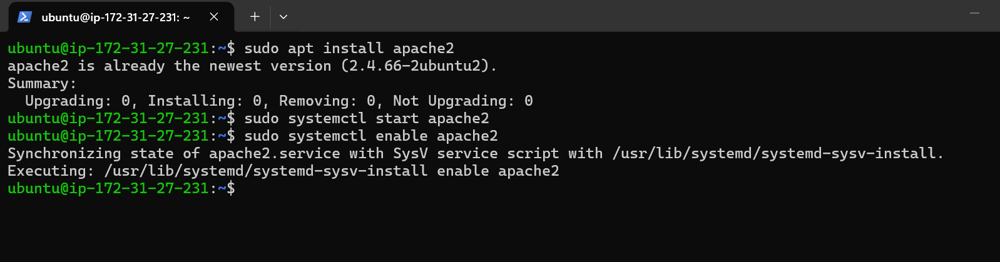
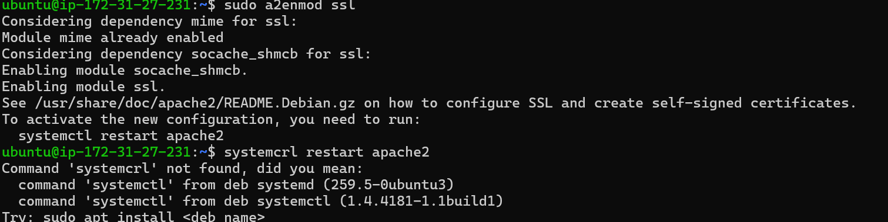
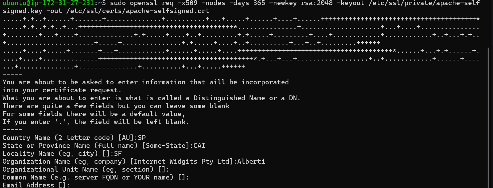
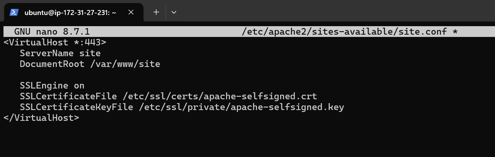
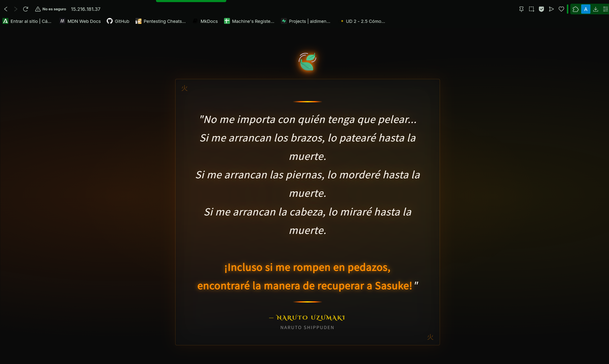
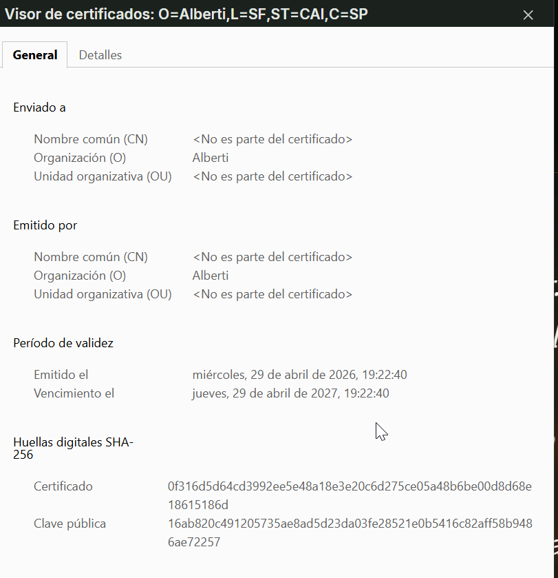
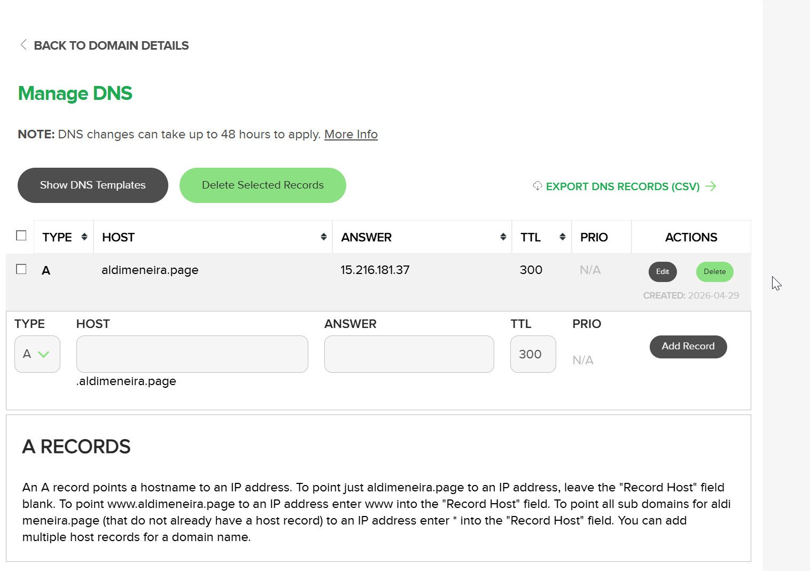
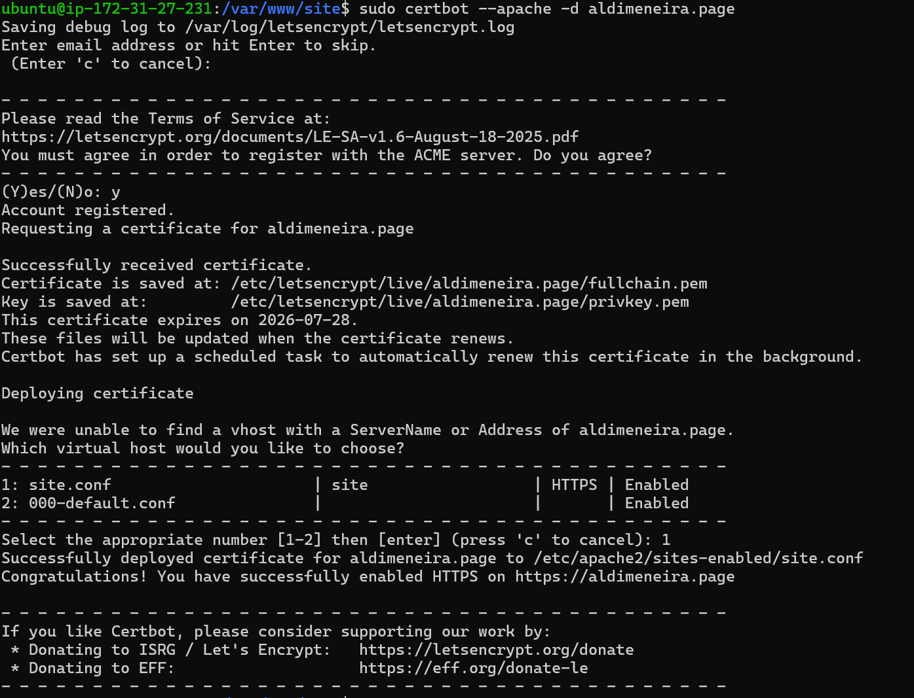
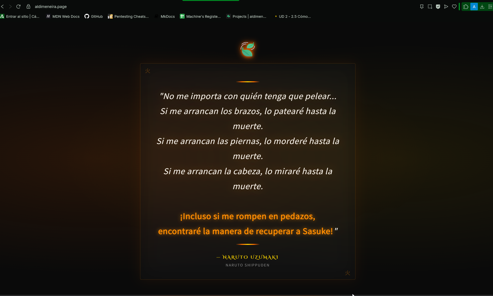
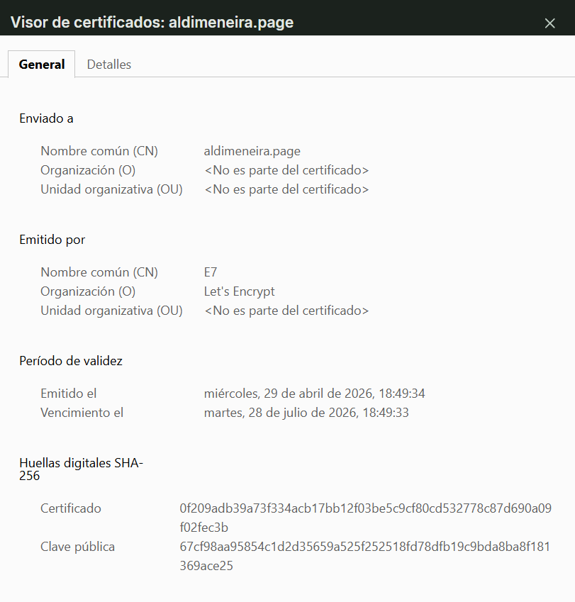

Procdemos a descargar, instalar y habilitar apache2

Ahora, procedemos a instalar el SSL

Creamos el certificado autofirmado de SSL

Creamos una pagina de prueba

Comprobamos el certificado de la página que hemos creado

Procedemos a redirigir al dominio creado a la ip que hemos creado en el servidor aws

Creamos nuestro certificado propio 

Una vez realizado esto, ya tenemos el dominio creado

Nuestro certificado propio

Procedemos a comprobar el resultado del certificado que hemos creado en nuestro dominio analizandolo con la web https://www.ssllabs.com/ssltest/

