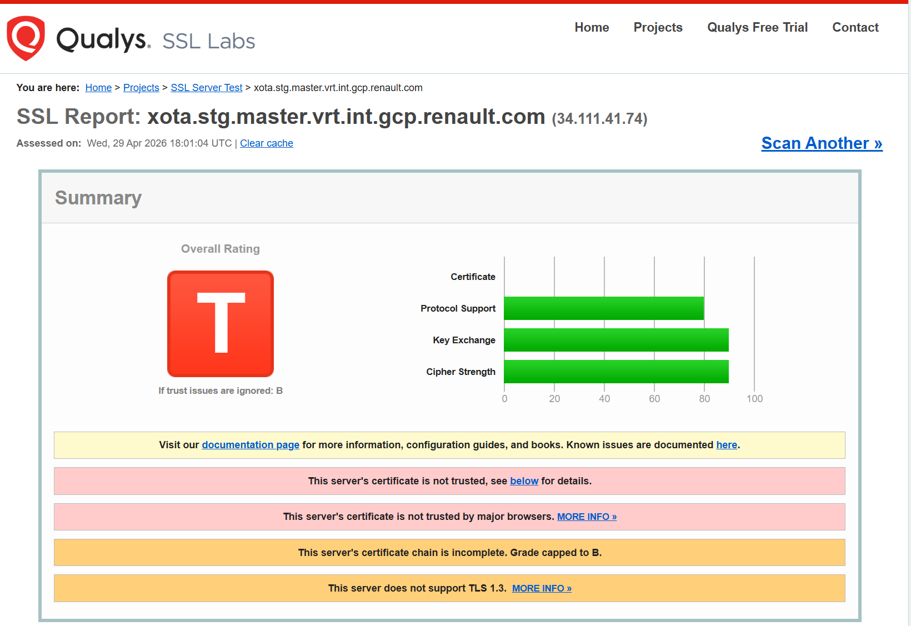
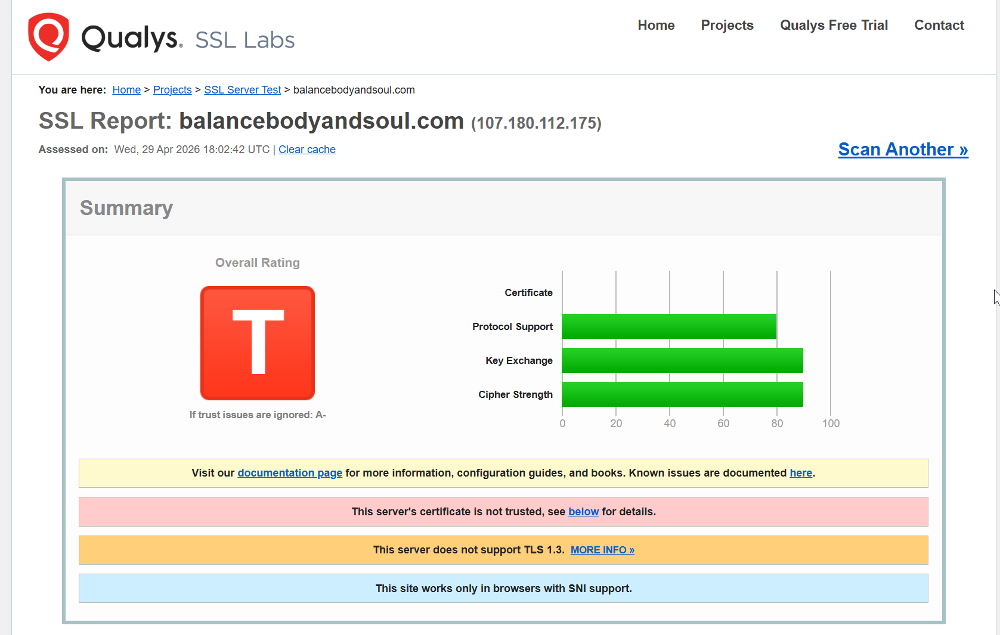
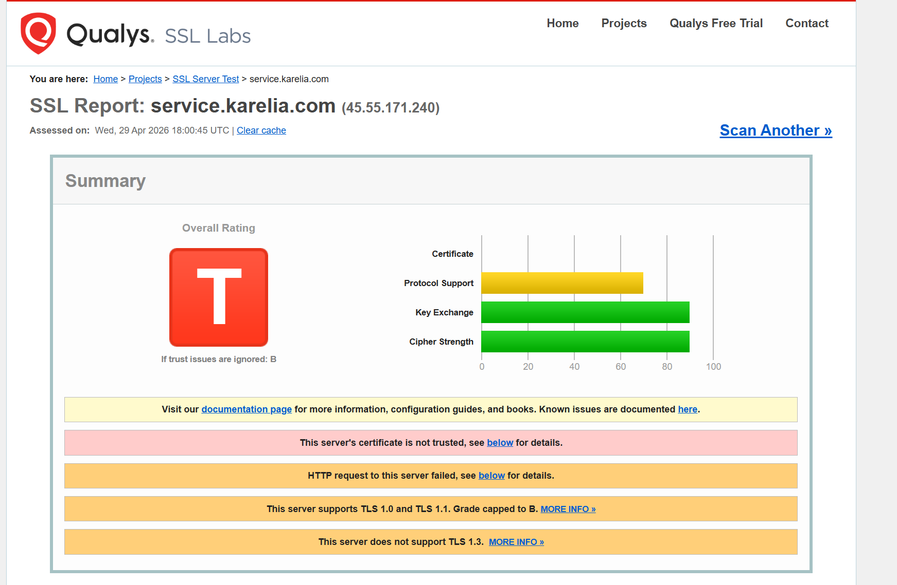

Procedemos a comprobar el resultado del certificado que hemos creado en nuestro dominio analizandolo con la web https://www.ssllabs.com/ssltest/

Ahora procedemos a analizar 3 certificados de SSLabs y por qué no funcionan:

## 1. Certificado 1: xota.stg.master.vrt.int.gcp.renault.com

**Resultado: NOT TRUSTED — CA interna no reconocida**

SSL Labs no puede analizar este dominio porque no es accesible públicamente.
La conexión directa al servidor sí devuelve el certificado con los siguientes datos reales:

| Campo        | Valor                                                                                   |
|--------------|-----------------------------------------------------------------------------------------|
| Subject (CN) | `*.stg.master.vrt.int.gcp.renault.com`                                                  |
| Emisor (CA)  | `Renault Car Centric Platform Staging CA` (O=Renault)                                   |
| Válido desde | 13 Ene 2025                                                                             |
| Válido hasta | 13 Ene 2029 (no caducado)                                                               |
| SAN          | `*.stg.master.vrt.int.gcp.renault.com`, `*.stg.emea.*`, `*.stg.kor.*`, `*.stg.latam.*` |
| Self-signed  | No                                                                                      |
| Estado       | NOT TRUSTED en navegadores públicos                                                     |

**Motivo del error:** El certificado fue emitido por `Renault Car Centric Platform Staging CA`,
una Autoridad de Certificación interna y privada de Renault que no está incluida en ningún
almacén de CAs raíz público (Mozilla, Windows, Apple, Android). El navegador no puede construir
una cadena de confianza hasta una CA raíz conocida, por lo que lanza `NET::ERR_CERT_AUTHORITY_INVALID`.
El certificado en sí es técnicamente correcto (no caducado, cubre el dominio), pero al no proceder
de una CA de confianza pública, es inválido para cualquier usuario externo.

**Tipo de error:** CA privada / no reconocida

---

## 2. Certificado 2: balancebodyandsoul.com

**Resultado: NOT TRUSTED — Certificado caducado + Mismatch de nombre de dominio**

Analizado con Qualys SSL Labs (caché del 22 Ene 2026). El servidor devuelve
**dos certificados simultáneos**, ambos inválidos:

### Certificado #1

| Campo        | Valor                                          |
|--------------|------------------------------------------------|
| Subject (CN) | `balancebodyandsoul.com`                       |
| Emisor       | `balancebodyandsoul.com` (se firma a sí mismo) |
| Válido desde | 11 May 2021                                    |
| Válido hasta | 11 May 2022 — EXPIRADO (hace ~3 años)          |
| SAN          | `balancebodyandsoul.com`                       |
| Self-signed  | Sí                                             |
| Estado       | EXPIRED + NOT TRUSTED                          |

**Motivo:** El campo `NotAfter` del X.509 superó su fecha límite hace más de 3 años.
Además, al estar autofirmado (emisor = sujeto), ningún almacén de CAs raíz lo reconoce.
Error en navegador: `NET::ERR_CERT_DATE_INVALID`.

### Certificado #2

| Campo        | Valor                                                         |
|--------------|---------------------------------------------------------------|
| Subject (CN) | `*.prod.phx3.secureserver.net`                                |
| Emisor       | Starfield Secure Certificate Authority - G2 (CA legítima)     |
| Válido desde | 10 Mar 2025                                                   |
| Válido hasta | 11 Abr 2026 (vigente en el momento del análisis)              |
| SAN          | `*.prod.phx3.secureserver.net`, `prod.phx3.secureserver.net`  |
| Self-signed  | No                                                            |
| Estado       | MISMATCH + NOT TRUSTED                                        |

**Motivo:** La CA y la fecha son correctas, pero el campo SAN no contiene
`balancebodyandsoul.com` en ninguna de sus entradas. El navegador compara el hostname
solicitado con el SAN y no encuentra coincidencia.
Error en navegador: `NET::ERR_CERT_COMMON_NAME_INVALID`.

**Tipo de error:** Certificado caducado + Self-signed / Mismatch de nombre de dominio

---

## 3. Certificado 3: service.karelia.com

**Resultado: NOT TRUSTED — Certificado caducado (hace ~3 años y 10 meses)**

Verificado mediante conexión TLS directa al servidor:

| Campo        | Valor                                                                                                                                                  |
|--------------|--------------------------------------------------------------------------------------------------------------------------------------------------------|
| Subject (CN) | `henry.karelia.com`                                                                                                                                    |
| Emisor       | Let's Encrypt R3 (O=Let's Encrypt) — CA pública y reconocida                                                                                          |
| Válido desde | 05 Mar 2022                                                                                                                                            |
| Válido hasta | 03 Jun 2022 — EXPIRADO (hace 1.426 días)                                                                                                               |
| SAN          | `service.karelia.com`, `henry.karelia.com`, `ctrservice.karelia.com`, `mailservice.karelia.com`, `www2.karelia.com`, `thehitlist.com`, entre otros     |
| Self-signed  | No                                                                                                                                                     |
| Estado       | EXPIRED + NOT TRUSTED                                                                                                                                  |

**Motivo:** El certificado, emitido por Let's Encrypt (CA completamente legítima y reconocida),
caducó el 3 de junio de 2022 y nunca fue renovado. Los certificados de Let's Encrypt tienen
una validez de solo 90 días y requieren renovación automática; en este caso el proceso falló
o fue abandonado. Aunque `service.karelia.com` aparece correctamente en el SAN, la expiración
invalida el certificado por completo.
Error en navegador: `NET::ERR_CERT_DATE_INVALID`.

**Tipo de error:** Certificado caducado

---

